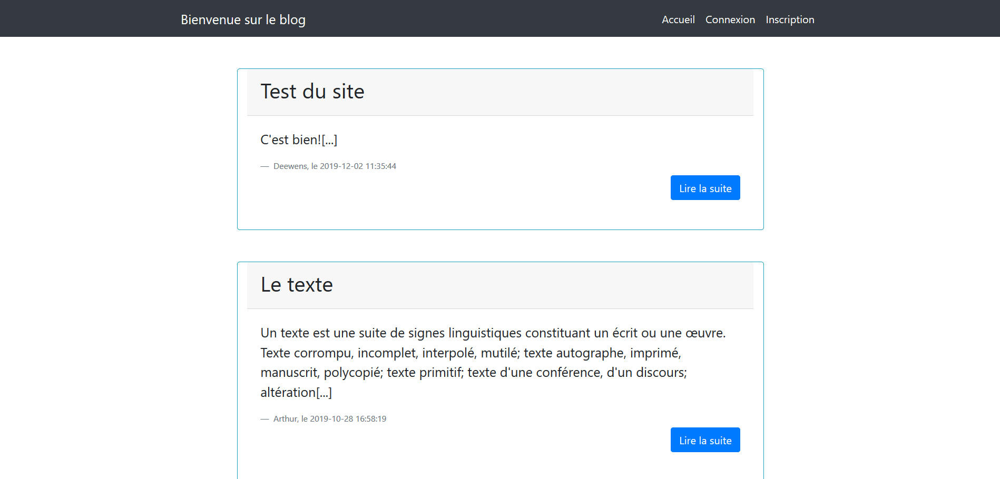
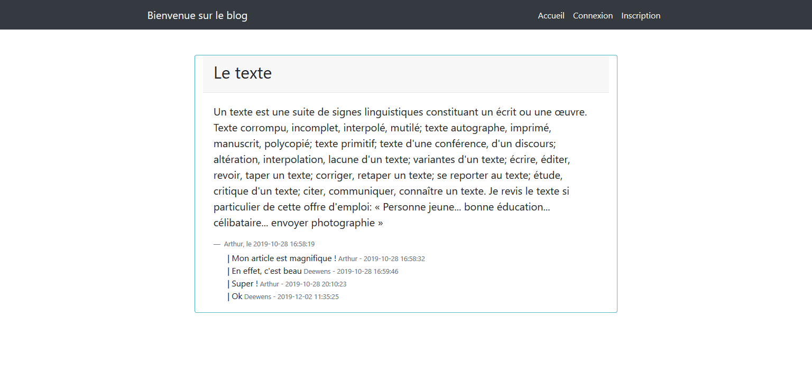
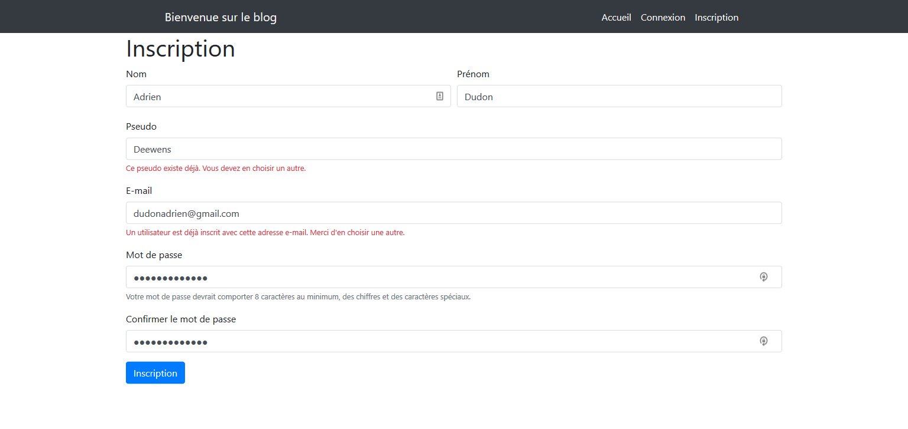
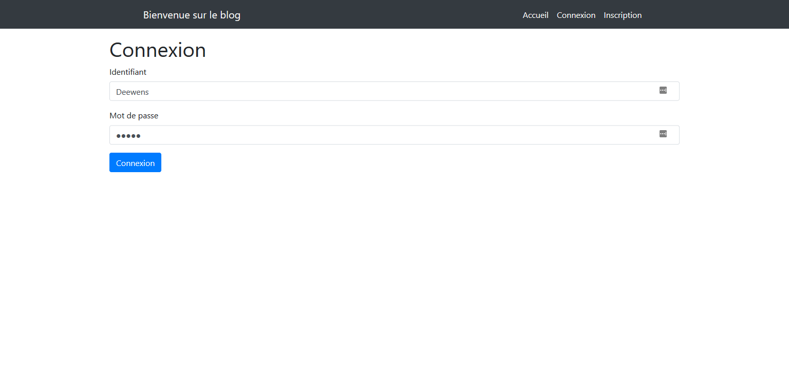
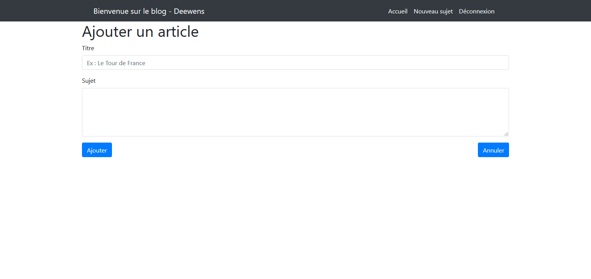

# Little blog

Little Blog is a blog site that allow logged in users to create blog post. Developed using PHP and MySQL for the backend, and HTML/CSS and JS for the layout and using Bootstrap 4 as CSS framework.

This project was carried out for the Web programming module course of my studies. Its final goal was to teach us how to create a dynamic website.

## Features
Little Blog is a site where you can post articles and comment on others' articles, if you are logged in.

Features are as follows:
* Registration and login system
* A logged-in user can create an article
* A logged-in user can post a comment on an article
* Security of data processing and data storage, including storage of user password

## Authors
* Deewens (Me)
* Arthur (https://github.com/Arthur57255)

---

# Screenshots

**Accueil - Home**

**Article - Post**

**Inscription - Sign in**

**Connexion - Log in**

**Ajouter un article - Add post**

